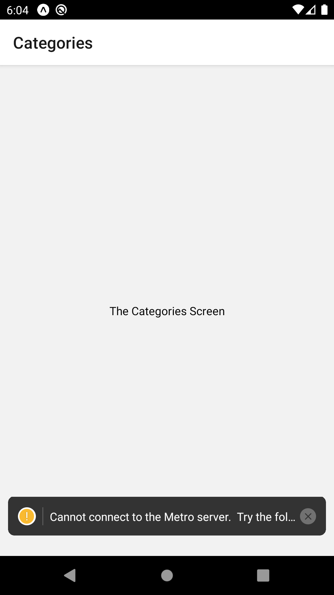

# React Native Navigation Sample App


## Steps

1. Install
```
expo init <PROJECT NAME>
expo import expo-font
expo install react-native-gesture-handler react-native-reanimated react-native-screens react-native-safe-area-context @react-native-community/masked-view
npm install --save react-navigation
npm install --save react-navigation-stack
expo install expo-app-loading
```

2. In App.js, import AppLoading and Font from react-navigation library:
```js
import { AppLoading } from 'expo';
import * as Font from 'expo-font';
```

3. Create Function to load fonts
```js
const fetchFonts = () => {
  return Font.loadAsync({
    'open-sans': require('./assets/fonts/OpenSans-Regular.ttf'),
    'open-sans-bold': require('./assets/fonts/OpenSans-Bold.ttf')
  });
};
```
 - Note that these fonts are downloaded from online sources and put into assets/fonts folder manually.

4. use useState method to set up font and set up AppLoading.

```js
import React, { useState } from 'react';
...
export default function App() {
  const [fontLoaded, setFontLoaded] = useState(false);

  if(!fontLoaded){
    return <AppLoading startAsync={fetchFonts} onFinish={() => setFontLoaded(true)}/>
  };

  return (
    <View style={styles.container}>
      <Text>Open up App.js to start working on your app!</Text>
      <StatusBar style="auto" />
    </View>
  );
}
```

5. Create screens folder and create *Screen.js, using sample template below
```js
import React from 'react';
import { View, Text, StyleSheet } from 'react-native';

const __NAME__Screen = props => {
  return (
    <View style={styles.screen}>
      <Text>The __NAME__ Screen</Text>
    </View>
  )
}

const styles = StyleSheet.create({
  screen: {
    flex: 1,
    justifyContent: 'center',
    alignItems: 'center'
  }
})

export default __NAME__Screen;
```

6. create navigation folder and create MealsNavigator.js
```js
import { createStackNavigator } from 'react-navigation-stack';
import { createAppContainer } from 'react-navigation';

import CategoriesScreen from "../screens/CategoriesScreen";
import CategoryMealScreen from "../screens/CategoryMealScreen";
import MealDetailScreen from "../screens/MealDetailScreen";

const MealsNavigator = createStackNavigator({
  Categories: CategoriesScreen,
  CategoryMeal: {
    screen: CategoryMealScreen
  },    // This is just a longer form (can apply other options)
  MealDetail: MealDetailScreen
});

export default createAppContainer(MealsNavigator);
```

7. In App.js, modify the return to return MealsNavigator instead.

```js
import MealsNavigator from './navigation/MealsNavigator';
...
export default function App() {
...
  return <MealsNavigator/>;    // Change to return MealsNavigator
}
```

8. Refresh to see the categories screen.



