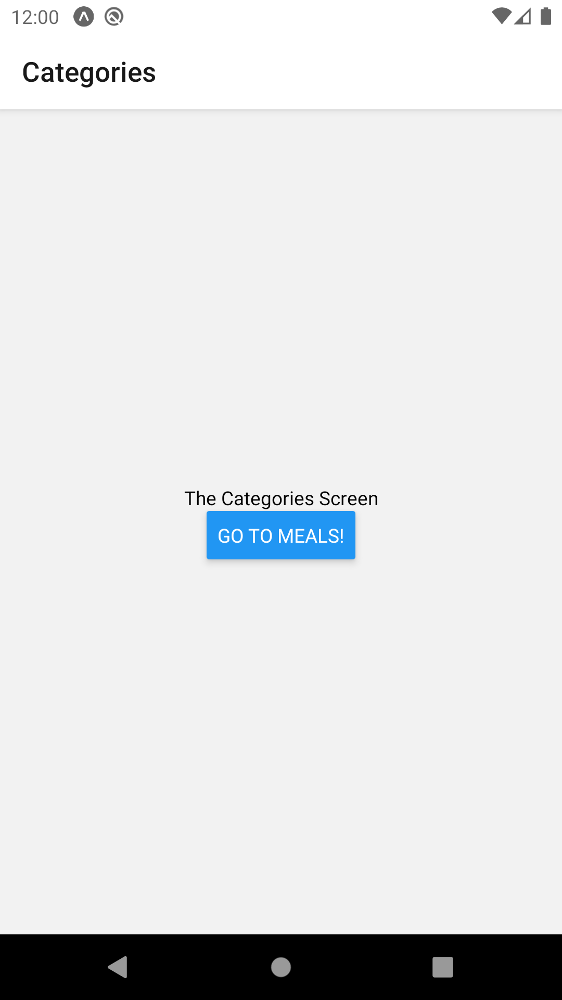
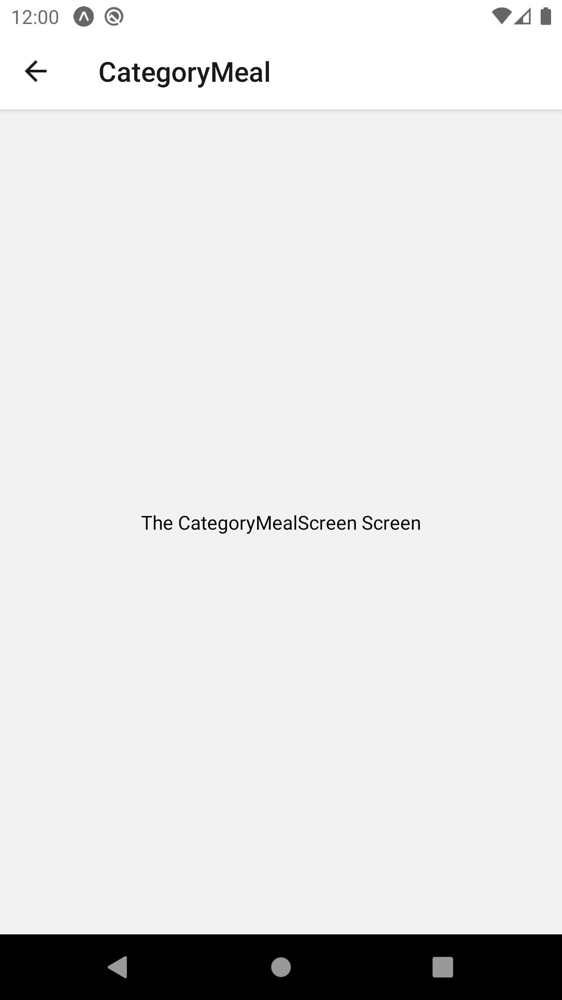
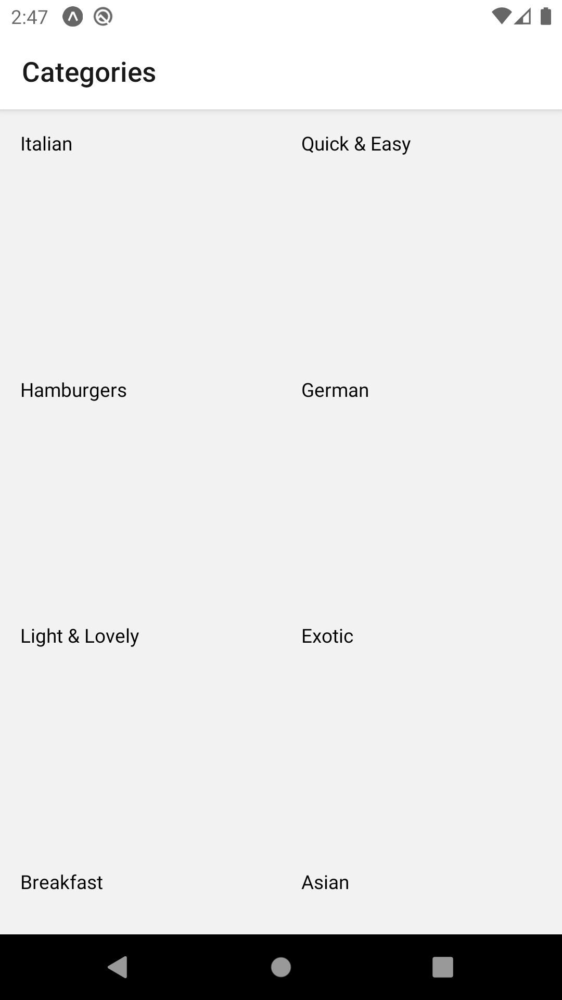

# React Native Navigation Sample App


## Steps

1. Install
```
expo init <PROJECT NAME>
expo import expo-font
expo install react-native-gesture-handler react-native-reanimated react-native-screens react-native-safe-area-context @react-native-community/masked-view
npm install --save react-navigation
npm install --save react-navigation-stack
expo install expo-app-loading
```

2. In App.js, import AppLoading and Font from react-navigation library:
```js
import { AppLoading } from 'expo';
import * as Font from 'expo-font';
```

3. Create Function to load fonts
```js
const fetchFonts = () => {
  return Font.loadAsync({
    'open-sans': require('./assets/fonts/OpenSans-Regular.ttf'),
    'open-sans-bold': require('./assets/fonts/OpenSans-Bold.ttf')
  });
};
```
 - Note that these fonts are downloaded from online sources and put into assets/fonts folder manually.

4. use useState method to set up font and set up AppLoading.

```js
import React, { useState } from 'react';
...
export default function App() {
  const [fontLoaded, setFontLoaded] = useState(false);

  if(!fontLoaded){
    return <AppLoading startAsync={fetchFonts} onFinish={() => setFontLoaded(true)}/>
  };

  return (
    <View style={styles.container}>
      <Text>Open up App.js to start working on your app!</Text>
      <StatusBar style="auto" />
    </View>
  );
}
```

5. Create screens folder and create *Screen.js, using sample template below
```js
import React from 'react';
import { View, Text, StyleSheet } from 'react-native';

const __NAME__Screen = props => {
  return (
    <View style={styles.screen}>
      <Text>The __NAME__ Screen</Text>
    </View>
  )
}

const styles = StyleSheet.create({
  screen: {
    flex: 1,
    justifyContent: 'center',
    alignItems: 'center'
  }
})

export default __NAME__Screen;
```

6. create navigation folder and create MealsNavigator.js
```js
import { createStackNavigator } from 'react-navigation-stack';
import { createAppContainer } from 'react-navigation';

import CategoriesScreen from "../screens/CategoriesScreen";
import CategoryMealScreen from "../screens/CategoryMealScreen";
import MealDetailScreen from "../screens/MealDetailScreen";

const MealsNavigator = createStackNavigator({
  Categories: CategoriesScreen,
  CategoryMeal: {
    screen: CategoryMealScreen
  },    // This is just a longer form (can apply other options)
  MealDetail: MealDetailScreen
});

export default createAppContainer(MealsNavigator);
```

7. In App.js, modify the return to return MealsNavigator instead.

```js
import MealsNavigator from './navigation/MealsNavigator';
...
export default function App() {
...
  return <MealsNavigator/>;    // Change to return MealsNavigator
}
```

8. Refresh to see the categories screen.


9. If you add a console.log(props) in CategoriesScreen.js, you will see this:
```js
Object {
  "navigation": Object {
    "actions": Object {
      "dismiss": [Function dismiss],
      "goBack": [Function goBack],
      "navigate": [Function navigate],
      "pop": [Function pop],
      "popToTop": [Function popToTop],
      "push": [Function push],
      "replace": [Function replace],
      "reset": [Function reset],
      "setParams": [Function setParams],
    },
    "addListener": [Function addListener],
    "dangerouslyGetParent": [Function anonymous],
    "dismiss": [Function anonymous],
    "dispatch": [Function anonymous],
    "emit": [Function emit],
    "getChildNavigation": [Function getChildNavigation],
    "getParam": [Function anonymous],
    "getScreenProps": [Function anonymous],
    "goBack": [Function anonymous],
    "isFirstRouteInParent": [Function isFirstRouteInParent],
    "isFocused": [Function isFocused],
    "navigate": [Function anonymous],
    "pop": [Function anonymous],
    "popToTop": [Function anonymous],
    "push": [Function anonymous],
    "replace": [Function anonymous],
    "reset": [Function anonymous],
    "router": undefined,
    "setParams": [Function anonymous],
    "state": Object {
      "key": "id-1611374247692-0",
      "routeName": "Categories",
    },
  },
  "screenProps": undefined,
}
```
 - In navigation, you see that we have many functions that we can use.

10. Add button to move from categoryScreen to categorymealscreen:
```js
const CategoriesScreen = props => {
  ...
  <Button title="Go to Meals!" onPress={() => {
    props.navigation.navigate({routeName: 'CategoryMeal'})  // routeName has to be defined in MealsNavigator.js
  }}></Button>
  ...
}
```




11. 按照第10个步骤，在 “categorymeal” 再弄多一次。

12. push, pop, replace

**Push**

 - props.navigate 还有其他的函数，其中一个是push。push和navigate有什么区别？你可以使用push把一个同样的screen加到stack中，但navigate就无法做到这点，使用navigate在同样的screen不会有任何效果。
 - 什么时候会需要push同样的screen？假设你要设计一个Dropbox APP，一个文件夹里可能有其他文件夹，当我们在某一个文件夹里的时候，我们可以显示一个folderScreen，当我们要进入这个文件夹里的其他文件夹时，我们就需要push一个内容不同的同类folderScreen。
 
```js
props.navigation.push("CategoryMeal")
```

**Go Back (pop)**

 - props.navigate有三种pop：\*.pop, \*.goBack()和 \*.popToTop()。pop()与goBack()的功能一样，唯一不同的是pop可以使用在其他的navigator，但goBack仅可用在stackNavigator。popToTop()会pop走所有的screen，直接回到第一个（最底层）的screen。

```js
props.navigation.pop();
props.navigation.goBack();
props.navigation.popToTop();
```

**Replace**

 - 替代功能
```js
props.navigation.replace('__SCREENNAME__');
```

13. Outputting a Grid of Categories

 - 首先，我们创建一个class叫Category（category.js)，侧有id, title, color。
```js
class Category{
  constructor(id, title, color){
    this.id = id;
    this.title = title;
    this.color = color;
  }
}

export default Category;
```

 - 之后，我们定义一个categories数组常数。
```js
import Category from '../models/category';

export const CATEGORIES = [
  new Category('c1', 'Italian', '#f5428d'),
  new Category('c2', 'Quick & Easy', '#f54242'),
  new Category('c3', 'Hamburgers', '#f5a442'),
  new Category('c4', 'German', '#f5d142'),
  new Category('c5', 'Light & Lovely', '#368dff'),
  new Category('c6', 'Exotic', '#41d95d'),
  new Category('c7', 'Breakfast', '#9eecff'),
  new Category('c8', 'Asian', '#b9ffb0'),
  new Category('c9', 'French', '#ffc7ff'),
  new Category('c10', 'Summer', '#47fced')
];
```

 - 在CategoriesScreen.js，我们把原本的代码删掉，改用Flatlist来显示我们刚定义的categories数组常数。
```js
import { CATEGORIES } from '../data/dummy-data';

const renderGridItem = (itemData) => {
  return (
    <View style={styles.gridItem}>
      <Text>{itemData.item.title}</Text>
    </View>
  )
}

const CategoriesScreen = props => {
  return (
    <FlatList 
      keyExtractor={(item, index) => item.id}
      data={CATEGORIES} 
      renderItem={renderGridItem} 
      numColumns={2} />
  )
}

const styles = StyleSheet.create({
  ...
  gridItem: {
    flex: 1,
    margin: 15,
    height: 150
  }
})
```

 - 以下是结果：


